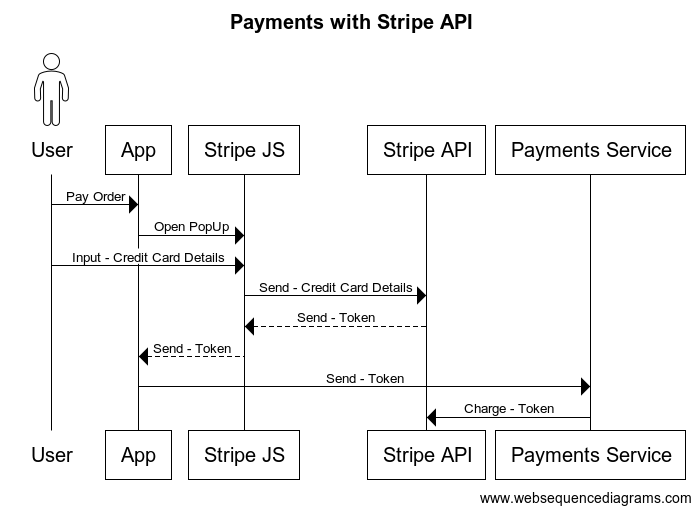

# Payments Service

This project has similar structure to `tickets` project. For more references refer to `tickets` project README.md.

The main responsibility of this service is to handle payments for tickets.

We will use the **Stripe** payments platform in order to charge user's credit card.

## Payments with Stripe

Below is the description of the payment flow:



### Steps for implementing payments with Stripe

#### 1. Install `Node Stripe SDK` npm module

- `npm i stripe`

#### 2. SignUp for a Stripe account and get an API Key

References: https://www.udemy.com/course/microservices-with-node-js-and-react/learn/lecture/19826486

- go to https://stripe.com/
  - the look and feel of the page changes quite often
  - the API is famous for staying stable
- create a Stripe account
- once logged-in, from the landing page go to **API keys** section
  - the **Secret key** will allow us to reach to the Stripe API and charge a User's credit card
- the **Secret key** should be stored inside of our Kubernetes cluster as a secret
  - `kubectl create secret generic stripe-secret --from-literal STRIPE_KEY={stripe_secret_key}`
- reference the **STRIPE_KEY** from the `payments-depl.yaml`

#### 3. Initialize the Stripe SDK

- just create an instance of `Stripe` and make it available inside the project

```ts
import Stripe from 'stripe';

export const stripe = new Stripe(process.env.STRIPE_KEY!, {
  apiVersion: '2020-08-27',
});
```

#### 4. Create a Stripe charge

Use the documentation available on: https://stripe.com/docs/api/charges/create?lang=node

```ts
import { stripe } from '../stripe';

//...
await stripe.charges.create({
  currency: 'ron',
  amount: order.price * 100, // we have to provide the smallest unit
  source: token,
  description: 'Payment for ticket', // this is optional
});
```
